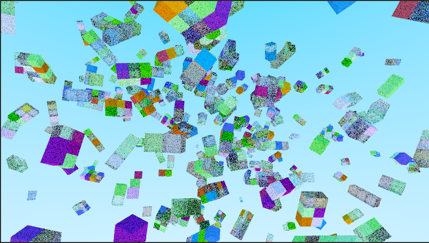

This project demonstrates how to create complex voxel objects in Unity ECS using Compound Colliders. Each voxel consists of a rendering material instance data and box collider.

The path tracer is by INedelcu.

[Pathtracing] https://github.com/INedelcu/PathTracingDemo

[MeshInstancing] https://github.com/INedelcu/RayTracingMeshInstancingSimple

See my post on Unity Forums regarding Compound Colliders:

https://forum.unity.com/threads/coding-compound-colliders.1506245/#post-9439400

Youtube Demo of this Engine:

https://www.youtube.com/watch?v=O1Si7Evk-mo

My Other YouTube Demos of INedelcu's Path Tracer:

https://youtu.be/QgpVbYmKcmo

https://youtu.be/vmOfpUK6mK8

